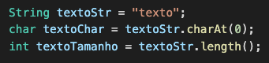
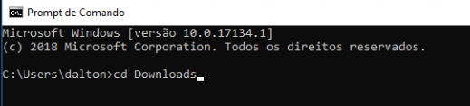

# Introdução à Programação (IP) - Trabalho Final

Prazo máximo para definir as equipes: 22/06/2022.  
Prazo máximo para apresentação do trabalho: 29/06/2022.  
Para as equipes que VIEREM PRESENCIALMENTE em sala de aula nas aulas da disciplina e NÃO CONSEGUIREM apreentar dia 29/06 poderão apresentar segunda-feira, dia 04/07.
Equipes: duplas (caso o número de alunos seja ímpar, poderá ter um trio).  

## Definições

- Só é permitido o uso de comandos estudados em sala de aula até o momento.  
- O conteúdo necessário para desenvolver este trabalho em sua grande maioria são conteúdos já abordados nas aulas, mas algumas partes serão explicadas durante as aulas destinadas ao desenvolvimento do trabalho, bem como, uma parte será de pesquisa extra-classe.  
- As dúvidas referente a este trabalho serão respondidas SOMENTE durante os dias/horários das nossas aulas.  
- Lembre de consultar o repositório desta disciplina para ajudar no desenvolvimento deste trabalho.  
- Os trabalhos podem ser desenvolvidos em equipe, mas as avaliações serão individuais, podendo gerar notas diferentes para cada integrante da equipe.  
- Uma vez apresentado o trabalho para avaliação, este não poderá ser reapresentado.  
- A ordem de apresentação dos trabalhos serão definidos pelo professor, e poderão ser somente apresentados durante os dias/horários de aula definidos no cronograma.  
<!-- - O professor criar uma chamada com TODOS os integrantes da equipe, e num primeiro momento vai conversar individualmente com cada integrante da equipe, e no final com todos integrantes juntos.   -->
<!-- - O professor vai conversar individualmente com cada integrante da equipe, e no final com todos integrantes juntos.  
- Durante a chamada o aluno precisará compartilhar sua tela e, eventualmente, abrir sua câmera para conversar com o professor. No caso do compartilhamento de tela, o aluno deverá mostrar o código desenvolvido na IDE VSCode (ou outra da sua escolha) para permitir editar e executar o referido código se for preciso.   -->
- Durante a apresentação do trabalho o aluno deverá mostrar o código desenvolvido na IDE VSCode (ou outra da sua escolha) para permitir editar e executar o referido código se for preciso.  
<!-- - Assim que quiserem fazer a apresentação do trabalho final avisem para o professor usando o seu canal individual no MS-Teams.   -->
- Assim que a equipe quiser fazer a apresentação do trabalho final deve avisar para o professor.  
- A apresentação só poderá ser feita após a equipe postar os fontes (.java) do trabalho no AVA3.  
- O código postado/apresentado não pode ter erros de execução (use comentários para tirar possíveis erros).  

Com base nas seguintes descrições, implemente o problema do: **Caça Palavras**.  

**ATENÇÃO**: deve seguir fielmente a descrição seguinte.  

Ter uma classe descrita a seguir …  

## CacaPalavras

- o único import que deve ser usado é *java.util.Scanner*;  
- o construtor declara a única ocorrência do objeto *teclado* da classe *Scanner* para permitir ler dados do console usando o teclado;
- o método main só instância o construtor desta classe;  
- o construtor declara todas as matrizes (*palavras* e *mapa);  
- a matriz *palavras* tem o tamanho 5 por 2;  
- a matriz *mapa* tem o tamanho 10 por 5;  
- o construtor chama o método *palavrasEntrada*;  
- o construtor chama o método *mapaEntrada* para atribuir os caráteres a matriz *mapa*;  
- o construtor chama o método *mapaPesquisa* para fazer a pesquisa das *palavras* no *mapa* e armazenar em *palavras* se achou a palavra no *mapa*;  
- o construtor controla o "_____ Menu: Caça Palavras _____", que deve ser implementado usando um ```Do/While``` e seguir as mensagens como demostrado no exemplo de execução. As opções deste menu são:  
  - opção 1: chamar o método *palavrasImprimir*;  
  - opção 2: chamar o método *mapaImprimir*;  
  - opção 3: chamar o método *palavrasRepostas*;  
  - opção 4: sair;  
  - consistir se foi digitado uma opção errada "Opção ERRADA!...".

O método *palavrasEntrada* deve atribuir as palavras abaixo à matriz *palavras*:

    palavras[0][0] = "IFELSE";  
    palavras[1][0] = "FORA";  
    palavras[2][0] = "WHILE";  
    palavras[3][0] = "OBJETO";  
    palavras[4][0] = "VETOR";  

O método *palavrasImprimir* deve imprimir as palavras da matriz *palavras*.  

O método *palavrasRepostas* usa a segunda coluna da matriz *palavras* e se a palavra não foi encontrada imprime "Palavra NÃO encontrada". Mas se a palavra foi encontrada deve-se imprimir a linha e coluna do mapa do primeiro caratere da palavra (conforme demostrado no exemplo de execução).  

O método *mapaEntrada* deve atribuir os caracteres abaixo à matriz *mapa*:

    mapa[ 0][ 0]='D';  mapa[ 0][ 1]='C';  mapa[ 0][ 2]='Q';  mapa[ 0][ 3]='W';  mapa[ 0][ 4]='E';
    mapa[ 1][ 0]='I';  mapa[ 1][ 1]='X';  mapa[ 1][ 2]='F';  mapa[ 1][ 3]='O';  mapa[ 1][ 4]='R';
    mapa[ 2][ 0]='F';  mapa[ 2][ 1]='F';  mapa[ 2][ 2]='R';  mapa[ 2][ 3]='G';  mapa[ 2][ 4]='F';
    mapa[ 3][ 0]='E';  mapa[ 3][ 1]='L';  mapa[ 3][ 2]='I';  mapa[ 3][ 3]='H';  mapa[ 3][ 4]='W';
    mapa[ 4][ 0]='L';  mapa[ 4][ 1]='S';  mapa[ 4][ 2]='F';  mapa[ 4][ 3]='O';  mapa[ 4][ 4]='U';
    mapa[ 5][ 0]='S';  mapa[ 5][ 1]='D';  mapa[ 5][ 2]='G';  mapa[ 5][ 3]='T';  mapa[ 5][ 4]='S';
    mapa[ 6][ 0]='E';  mapa[ 6][ 1]='J';  mapa[ 6][ 2]='H';  mapa[ 6][ 3]='E';  mapa[ 6][ 4]='T';
    mapa[ 7][ 0]='I';  mapa[ 7][ 1]='I';  mapa[ 7][ 2]='I';  mapa[ 7][ 3]='J';  mapa[ 7][ 4]='M';
    mapa[ 8][ 0]='X';  mapa[ 8][ 1]='C';  mapa[ 8][ 2]='K';  mapa[ 8][ 3]='B';  mapa[ 8][ 4]='G';
    mapa[ 9][ 0]='V';  mapa[ 9][ 1]='E';  mapa[ 9][ 2]='T';  mapa[ 9][ 3]='O';  mapa[ 9][ 4]='R';

O método *mapaImprimir* deve imprimir os caracteres da matriz *mapa* conforme demostrado no exemplo de execução.  

O método *mapaPesquisa* faz a pesquisa para verificar se as palavras da matriz *palavras* se encontram na matriz *mapa*.  

**Observações**:  

- caso julgue necessário podem ser criados novos métodos *private* para serem chamados pelo método *mapaPesquisa*;  
- a busca por palavras no mapa (método *mapaPesquisa*) só precisam tratar de palavras que podem aparecer na horizontal (da esquerda para direita e da direita para esquerda) e na vertical (de cima para baixo e de baixo para cima).  

## Manipular Strings

Como mencionado no inicio do enunciado, "Só é permitido o uso de comandos estudados em sala de aula até o momento.". Bom, para poder pegar um caractere específico ou mesmo a quantidade de caracteres em uma ```String``` pode-se usar os comandos abaixo. Observe, NÃO é permitido mais nenhum tipo de comando que manipule uma String além destes (os que existem no conteúdo da nossa disciplina).  

  

## Exemplo da execução

As mensagens mostradas ao executar o código deste trabalho devem seguir o que é mostrado ao executar o [TrabalhoFinal.jar](TrabalhoFinal.jar "TrabalhoFinal.jar").  

### Como executar um JAR

- Abra o console do Windows pressionando a tecla Windows e depois digitando ```cmd``` e pressionar ```enter```. Se for Linux ou MacOS abra o “terminal"  
  

- Agora mude de pasta, para pasta que tem o **TrabalhoFinal.jar**. No meu caso para pasta de Download  
  

- E para executar digitar

  > java -jar TrabalhoFinal.jar

- Pronto, é só usar ... e ver como deve ficar as saídas.
